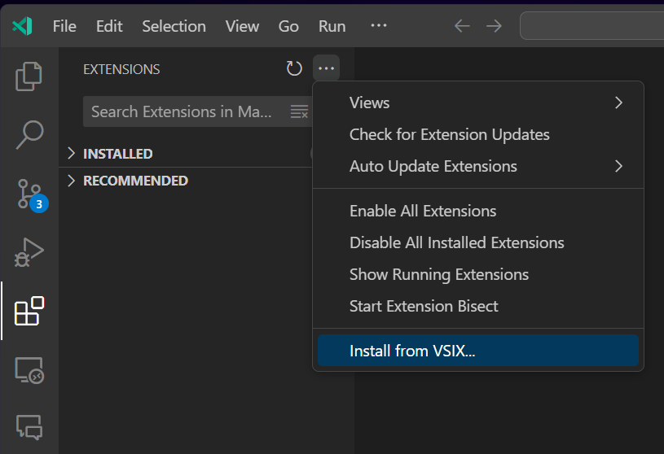
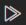
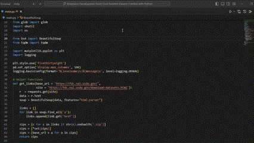

# codeHistories

A VS Code extension that aims to capture the information needed to generate usable code histories (capturing code state and output). The extension is designed to help users keep track of their code changes and outputs in a more granular way than traditional version control systems. The extension is currently in active development, so to use it you can install from the vsix package included in this repo.

## Requirements

* Node JS + simple-git (https://github.com/steveukx/git-js) to incorporate git in the output tracking process
* active-win (https://github.com/sindresorhus/active-win) to detect application switch between VS Code and Chrome
* Git Bash (https://gitforwindows.org) for Windows user
* PowerShell (https://learn.microsoft.com/en-us/powershell/scripting/install/installing-powershell)

## Extension Setup

1.  Download the file ```code-histories.vsix``` from this repository.

2.  Open your project folder in VSCode.

3.  Go into the Extensions view , select the ... ellipsis View and More Actions button, and select Install from VSIX. Then find and open the file ```code-histories.vsix```.

<p align="center">
  
</p>

4.  Once the extension is installed, you will be prompted to use either a bash profile or a PowerShell profile. Make sure those shells are already installed on your system

5.  Upon choosing one of the profiles, a new terminal will be opened and the profile will be automatically loaded into the terminal. This profile essentially allows you to use the keyword ```codehistories``` (e.g. ```codehistories python main.py```) to capture the code state and output.

## Important notes

1. When the extension starts, it will automatically create a custom .bash_profile in your project's folder to make sure that when you run ```codehistories <cmd> [args]```, the bash terminal can understand and capture the execution's output. You need to always run your code with ```codehistories``` as prefix since it is an important keyword for the tool to capture both the output and the code state.

2. In case you don't want to type out full execution command every time, you use Ctrl + Shift + C (or CMD + Shift + C on Mac) to update the command for the subsequent executions. Then you can press the multi-play  button to run the updated execution. For e.g. if you want to run a python file, you set the command to ```python main.py```. Note that this command will be updated for all future executions until you change it again.

3. Please don’t make changes while the code is running, as these may not be captured correctly. Also, if you feel that a commit was incorrectly triggered, there is the "Undo Code Histories commit" button  so you can undo and go back to the previous commit.

4. To enter goals/subgoals or auto quick commit, right click to open context menu. Goals/subgoals will be saved in the file "goals.txt".

<p align="center">
  
</p>

5. To use git commands that are related to codeHistories.git, you need to add ```--git-dir=codeHistories.git --work-tree=.``` between ```git``` and the command. For e.g. ```git --git-dir=codeHistories.git --work-tree=. log --pretty=oneline``` to view the codeHistories commits. Occasionally checking this would be a good idea since the files color change only corresponds to normal .git repo.

6. For complex web project example, refer to line 178-198 in src/extension.js. In general, for execution run, add ```codehistories``` prefix to the command. For web dev run, no need to really use ```codehistories``` prefix. Instead, make use of tee command to log output continuously while the capturing mechanism happens when user moves away from VS Code to Chrome to (re)load localhost. E.g. ```npm start | while IFS= read -r line; do echo "[$(date '+%m/%d/%Y, %I:%M:%S %p')] $line"; done | tee -a server2.txt```, ```python -u -m http.server 8000 2>&1 | tee >(awk '{ print $0; fflush(); }' >> server2.txt)```

## Release Notes

### V1

Initial release of codeHistories. Basic output capture of installed Python extension when the user uses "run" button option. Can utilize "gitk" to view the code state and output.

### V1.x

Added Mac support and revamped Windows support. It is recommended that user avoid directly interacting with VS Code terminal as some cases (such as "cd" or "ls") might lead to incorrect/unnecessary git commit. Output captured might contain a few additional path strings.

### V2

Avoid resizing VS Code window when the code is executing as that might impact the terminal write data event. V2 can arguably support other languages besides Python. The user can change that settings in extension.js where event.terminal.name == "Code" instead of "Python". Note that Code Runner extension should be installed in the debugging window for this to work.

### V2.x

Added support for Linux. A custom "Code Histories commit" button is added to enforce correct output capture behavior (i.e. only when the user clicks on this button). For directly typed executions in the terminal, there has not been a better solution than asking the user to revert a commit if it was triggered wrong. Comment out ```if(checkThenCommit)``` statement in extension.js to enable direct terminal execution capture.

### V3

Removed the need for code-runner extension. Using ```codehistories``` as a prefix in commands serves as a important keyword trigger for the tool to capture the code state and output. Currently safe to interact directly with the "Code Histories" terminal. Similar to code-runner, the user can use a run button to execute the code, but they would need to update the command using Ctrl + Shift + C (or CMD + Shift + C on Mac) before pressing the run button (Code Histories commit). The added pseudogit feature allows the user to keep various small commits related to codeHistories separate from .git.

### V3.x

Added application switch checking to help with web dev heuristic when user is gone from vs code to visit chrome and if they load localhost to test their program. Added right click option to context menu for user to quickly write down their goals/subgoals for record. Undo commit button is now a standalone button placed to the left of the commit button. ```codehistories```prefix is now combined with tee in Unix-like environment to optimize piping result to output.txt. "Code Histories" terminal is now generic "bash" terminal given that user should run ```source .bash_profile``` to be able to use ```codehistories``` prefix. Released vsix package for easier installation.

### V4

Detached from proposed APIs --> Simplified installation process. Added tracking for other background events such as navigation and selection. Currently adding support for live history webview.

## Contact

Feel free to let me know if there is any suggestions, comments, feedbacks, etc. at p.tri@wustl.edu

**Thanks and enjoy!**
